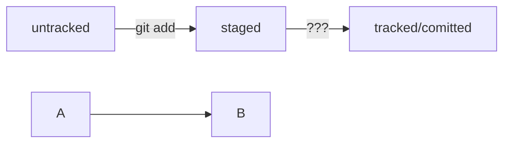

# Помощник по *GIT*

## Команды:

* touch - создание файла
* cat - чтение файла
* mkdir - создание папки
* rm - удаление
* clip - копирование

## Команды для создания и выгрузки коммита на *GitHub*

1. git init
2. git add README.md
3. git commit -m "first commit"
4. git push

HEAD -- это голова.
Коммит -- это всему голова.
Статусы файлов:
<тут пустая строка!>

```mermaid
%% описание схемы
```
<и тут пустая строка!>

